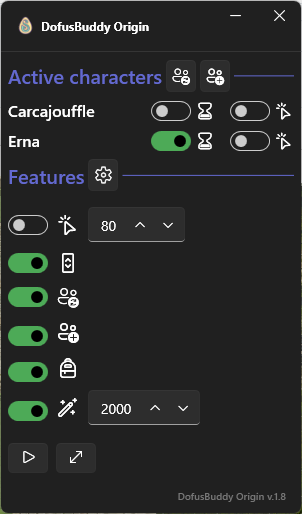

# DofusBuddy

DofusBuddy is a .NET 7 WPF application that aims to make your life easier when using multiple accounts on Dofus retro.

## Features

- Duplication of left mouse clicks on every game window with a delay
- Automatically switch to the active character window at the beginning of a fight or at the beginning of a game turn
- Automatically accept group and trade invitations coming for any of your character
- Automatically pass turn

## Prerequisites

- .NET 7 runtime
- Npcap <https://npcap.com/#download>

## Configuration

WIP
